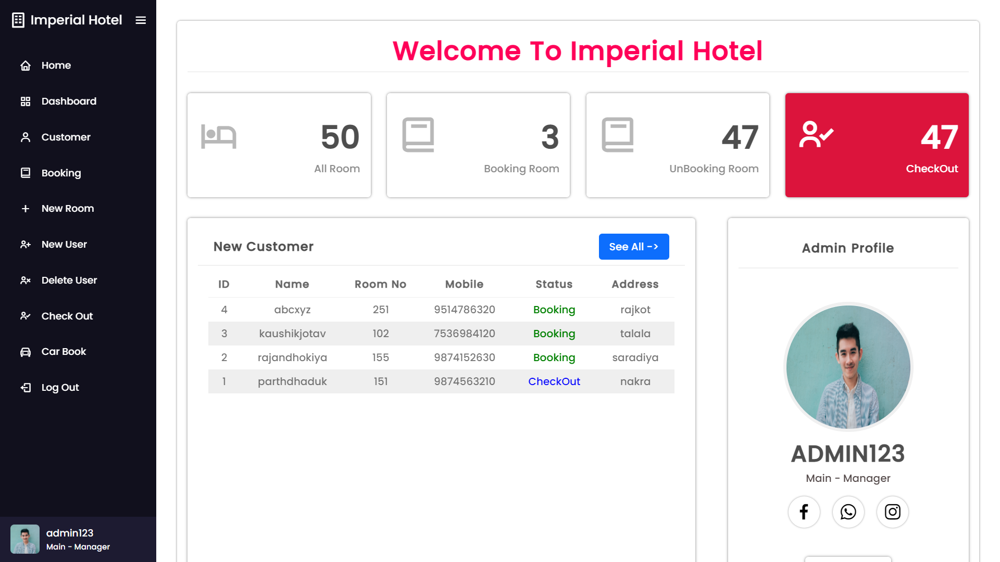
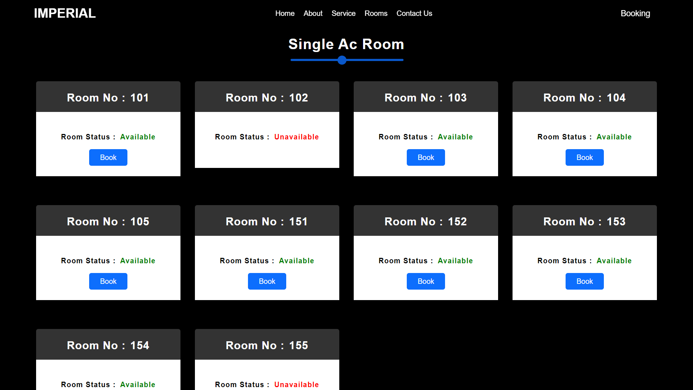
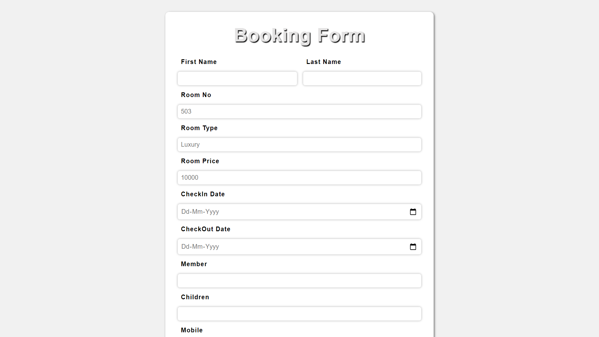
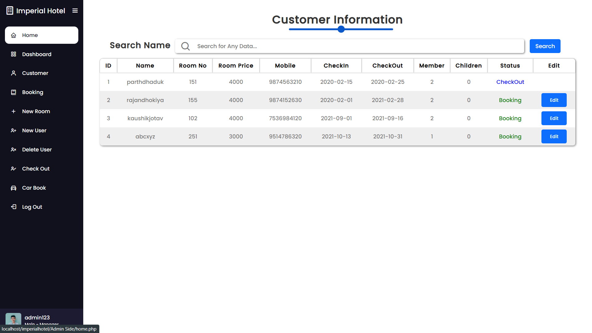
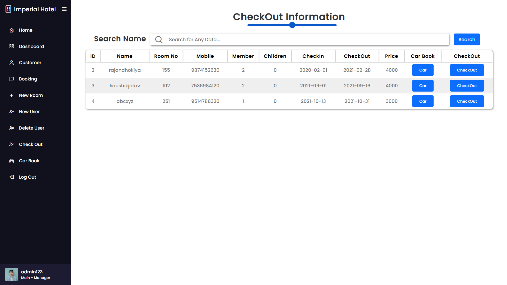
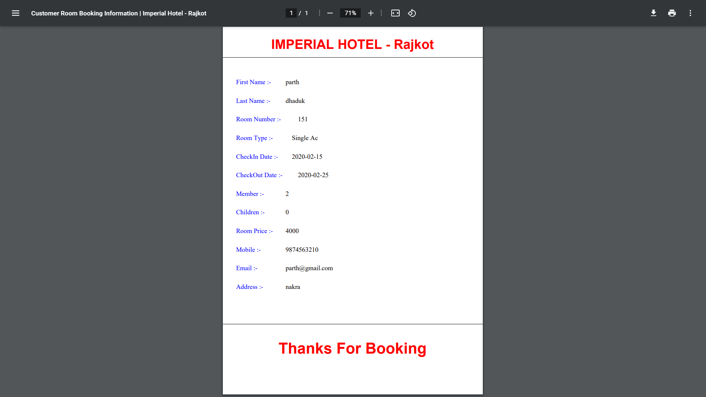

# 🏨 Hotel Management System

<div align="center">


[](https://developer.mozilla.org/en-US/docs/Web/HTML)
[](https://developer.mozilla.org/en-US/docs/Web/CSS)
[](https://developer.mozilla.org/en-US/docs/Web/JavaScript)
[](https://www.php.net/)
[](https://www.mysql.com/)
[](http://www.fpdf.org/)

A full-stack web application for managing hotel operations — bookings, rooms, staff, customers, billing, and PDF invoices.

</div>

---

## 🧾 About the Project

The **Hotel Management System** is a comprehensive web-based application designed to streamline daily hotel operations. It provides a centralized dashboard for admins and staff to manage room bookings (online & offline), handle guest records, manage staff, process checkouts, and automatically generate downloadable PDF invoices — all from a browser with no extra software required.

---

## ✨ Features

### 🔐 Authentication
- Secure login and registration system using PHP sessions
- Role-based access control — **Admin** and **Staff** roles
- Password hashing for secure credential storage
- Auto-redirect to dashboard on successful login

### 📅 Online Booking
- Guests can browse available rooms and make reservations online
- Real-time room availability check against the database
- Booking confirmation with unique Booking ID

### 🛋️ Offline Booking
- Receptionist can record walk-in guest bookings manually
- Full booking form with room selection, dates, and guest info
- Instantly updates room availability status

### 🏠 CRUD — Room Management
- **Create** new rooms with type, price, floor, and amenities
- **Read** full room list with availability status
- **Update** room details and pricing
- **Delete** rooms no longer in service

### 👥 Customer Management
- View and search all registered guests
- Track active vs. past guests

### 👔 Staff Handling
- Add new staff members with role assignment
- Edit staff details and permissions
- View all staff in a sortable, searchable table

### 🗑️ Delete Staff History
- Safely remove staff records from the system
- Preserves audit trail for compliance before deletion
- Admin-only action with confirmation prompt

### 📊 Dashboard
- Live overview: total bookings, available rooms, revenue, guest count
- Recent booking activity feed
- Quick-action buttons for common tasks

### 🚪 Checkout
- Process guest checkouts with one click
- Auto-calculates total bill based on stay duration and room price
- Marks room as available immediately after checkout

### 📄 Online PDF Download
- Generate professional booking invoices using **FPDF**
- Download receipts instantly from the booking or checkout page
- Invoice includes guest info, room details, dates, and total amount

---

## 🛠️ Technology Stack

| Technology | Version | Purpose |
|---|---|---|
| **HTML5** | 5 | Page structure & semantic markup |
| **CSS3** | 3 | Styling, responsive layout, animations |
| **JavaScript** | ES6+ | Client-side interactivity & form validation |
| **PHP** | 8.0+ | Server-side logic, routing, session management |
| **MySQL** | 8.0+ | Relational database for all data storage |
| **FPDF** | 1.86 | PDF invoice & receipt generation |
| **Apache** | — | Web server (via XAMPP / WAMP / Laragon) |

---

## 🚀 Setup & Installation

### ✅ Prerequisites

- [XAMPP](https://www.apachefriends.org/) (recommended) or WAMP / Laragon
- PHP **8.0+**
- MySQL **8.0+**
- A modern browser (Chrome, Firefox, Edge)

---

### Step 1 — Clone or Download

```bash
git clone https://github.com/dhadukparth/Hotel-Management-System.git
```

Or download the ZIP and extract it.

Then move the folder to your server root:

```
# XAMPP (Windows)
C:/xampp/htdocs/hotel-management-system/

# XAMPP (Linux/macOS)
/opt/lampp/htdocs/hotel-management-system/
```

---

### Step 2 — Create the Database

1. Start **Apache** and **MySQL** from the XAMPP Control Panel

2. Open **phpMyAdmin** → [http://localhost/phpmyadmin](http://localhost/phpmyadmin)

3. Click **"New"** and create a database named:
   
   ```
   hotel
   ```
   
4. Select `hotel` → click **"Import"** tab
  
5. Choose the file: `database/hotel.sql`
  
6. Click **Go** — all tables will be created automatically

---

### Step 3 — Configure Database Connection

Open `include/connection.php` and update with your credentials:

```php
<?php
$host     = "localhost";
$username = "root";
$password = "";
$database = "hotel";

$conn = mysqli_connect($host, $username, $password, $database);

?>
```

---

### Step 4 — Install FPDF
1. Download FPDF from [http://www.fpdf.org/](http://www.fpdf.org/)
2. Place `fpdf.php` inside the `pdf/` directory

---

### Step 5 — Run the Application

Open your browser and go to:

```
http://localhost/hotel-management-system/
```

> 🎉 The system should load and redirect you to the login page.

---

## 📸 Screenshots

> Add your screenshots inside an `screenshots/` folder and update the paths below.

| Dashboard | Room List | Booking Form |
|---|---|---|
|  |  |  |

| Customer List | Staff Panel | PDF Invoice |
|---|---|---|
|  |  |  |

---

## 🤝 Contributing

Contributions are welcome! Follow these steps:

1. **Fork** the repository
2. **Create** a feature branch
   ```bash
   git checkout -b feature/your-feature-name
   ```
3. **Commit** your changes
   ```bash
   git commit -m "Add: your feature description"
   ```
4. **Push** to the branch
   ```bash
   git push origin feature/your-feature-name
   ```
5. **Open a Pull Request** and describe what you've added or fixed

---

## 📝 License

This project is licensed under the **MIT License** — free for personal and commercial use.

---

<div align="center">

Made with ❤️ | If this project helped you, please ⭐ star the repository!

</div>
